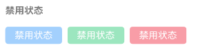

# Button 按钮

## 介绍

按钮用于触发一个操作，如提交表单。

## 引入

```typescript
import { WuButton } from '@itrain/wu-ui'
```

## 代码演示

### 按钮类型

按钮支持 `default`、`primary`、`success`、`warning`、`danger` 五种类型，默认为 `default`。


```typescript
WuButton({ type: 'primary', text: '主要按钮' })
WuButton({ type: 'success', text: '成功按钮' })
WuButton({ type: 'default', text: '默认按钮' })
WuButton({ type: 'danger', text: '危险按钮' })
WuButton({ type: 'warning', text: '警告按钮' })
```

### 朴素按钮

通过 `plain` 属性将按钮设置为朴素按钮，朴素按钮的文字为按钮颜色，背景为白色。


```typescript
WuButton({ type: 'primary', plain: true, text: '朴素按钮' })
WuButton({ type: 'success', plain: true, text: '朴素按钮' })
WuButton({ type: 'danger', plain: true, text: '朴素按钮' })
```

### 禁用状态

通过 `disabled` 属性来禁用按钮，禁用状态下按钮不可点击。



```typescript
WuButton({ type: 'primary', text: '禁用状态', disabled: true })
WuButton({ type: 'success', text: '禁用状态', disabled: true })
WuButton({ type: 'danger', text: '禁用状态', disabled: true })
```

### 按钮形状

通过 `square` 设置方形按钮，通过 `round` 设置圆形按钮。


```typescript
WuButton({ type: 'primary', text: '方形按钮', shape: 'square' })
WuButton({ type: 'success', text: '圆形按钮', shape: 'round' })
```

### 按钮尺寸

支持 `huge`、 `large`、`normal`、`small`、`mini` 五种尺寸，默认为 `normal`。


```typescript
WuButton({ type: 'primary', text: '超大号按钮', btnSize: 'huge' })
WuButton({ type: 'primary', text: '大号按钮', btnSize: 'large' })
WuButton({ type: 'primary', text: '普通按钮', btnSize: 'normal' })
WuButton({ type: 'primary', text: '小号按钮', btnSize: 'small' })
WuButton({ type: 'primary', text: '迷你按钮', btnSize: 'mini' })
```

### 块级按钮

通过 `block` 属设置块级按钮，使其占据100%的容器宽度。


```typescript
WuButton({ type: 'primary', text: '超大号按钮', btnSize: 'huge', block: true })
```

## API

### @Props

| 名称     | 说明                                                         | 类型        | 是否必需 | 默认值    |
| -------- | ------------------------------------------------------------ | ----------- | -------- | --------- |
| type     | 类型，<br>可选值为 `primary`、`success`、<br>`warning`、`danger`、`default` | string      | 否       | 'default' |
| text     | 按钮文字                                                     | ResourceStr | 否       | '按钮'    |
| shape    | 按钮形状，<br/>可选值为 `round` 与 `square`                  | string      | 否       | 'square'  |
| btnSize  | 尺寸，<br>可选值为 `large`、`small`、`mini`、`normal`、`huge` | string      | 否       | 'normal'  |
| plain    | 是否为朴素按钮                                               | boolean     | 否       | false     |
| disabled | 是否禁用按钮                                                 | boolean     | 否       | false     |
| block    | 是否块级按钮                                                 | boolean     | 否       | false     |

