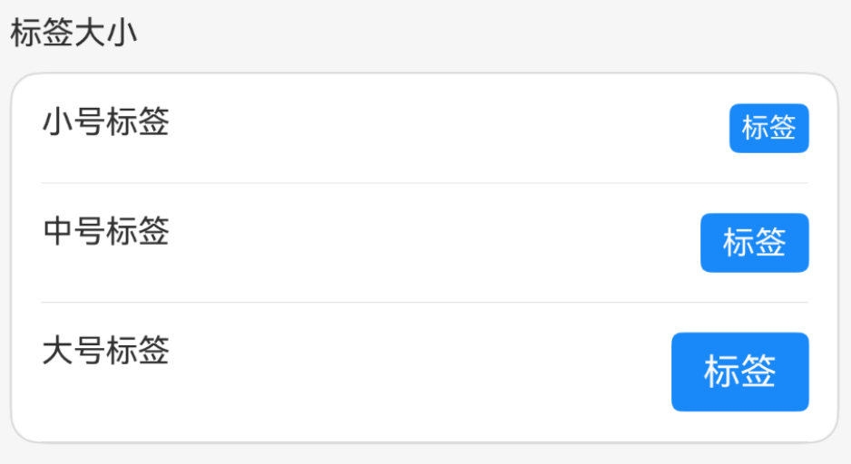

# Tag 标签

## 介绍

用于标记关键词和概括主要内容。

## 引入

```typescript
import { WuTag } from '@itrain/wu-ui'
```

## 代码演示

### 基础用法

通过 `type` 属性控制标签颜色。


```typescript
WuTag({
  type: 'primary',
  text: '标签',
})
WuTag({
  type: 'success',
  text: '标签',
})
WuTag({
  type: 'danger',
  text: '标签',
})
WuTag({
  type: 'warning',
  text: '标签',
})
WuTag({
  type: 'default',
  text: '标签',
})
```

### 样式风格

通过配置参数实现不同样式风格，示例：


```typescript
WuTag({
  type: 'primary',
  text: '标签',
  plain: true,
})
WuTag({
  type: 'primary',
  text: '标签',
  shape: 'round',
})
WuTag({
  type: 'primary',
  text: '标签',
  mark: true,
})
WuTag({
  type: 'primary',
  text: '标签',
  closeable: true,
})
```

### 标签大小

通过 `tagSize` 属性调整标签大小。



```typ
WuTag({
  type: 'primary',
  text: '标签',
  tagSize: 'small'
})
WuTag({
  type: 'primary',
  text: '标签',
  tagSize: 'normal'
})
WuTag({
  type: 'primary',
  text: '标签',
  tagSize: 'large'
})
```

### 自定义颜色

通过 `color` 和 `text-color` 属性设置标签颜色。


```typescript
WuTag({
  type: 'primary',
  text: '标签',
  color: '#7232dd',
})
WuTag({
  type: 'primary',
  text: '标签',
  textColor: '#ad0000',
})
WuTag({
  type: 'primary',
  text: '标签',
  color: '#7232dd',
  plain: true,
})
```

### 边框线宽

通过 `bordered` 与 `hairline` 控制是否显示边框及边框线宽。


```typescript
WuTag({
  type: 'primary',
  text: '标签',
  bordered: false,
})
WuTag({
  type: 'primary',
  text: '标签',
  color: '#7232dd',
  plain: true,
  // hairline: false, // 默认正常线宽
})
WuTag({
  type: 'primary',
  text: '标签',
  color: '#7232dd',
  plain: true,
  hairline: true, // 细边框
})
```

## API

### @Props

| 名称      | 说明                                                         | 类型        | 是否必需 | 默认值    |
| --------- | ------------------------------------------------------------ | ----------- | -------- | --------- |
| type      | 类型，可选值为: <br> `primary` `success` `danger` `warning` `default` | string      | 否       | 'default' |
| text      | 标签文本                                                     | ResourceStr | 否       |           |
| tagSize   | 大小, 可选值为 `large` `normal` `small`                      | string      | 否       | 'normal'  |
| color     | 标签颜色                                                     | string      | 否       |           |
| show      | 是否展示标签                                                 | boolean     | 否       | true      |
| plain     | 是否为空心样式                                               | boolean     | 否       |           |
| shape     | 形状样式, 可选值为 `square` `round`                          | string      | 否       |           |
| mark      | 是否为标记样式                                               | boolean     | 否       |           |
| textColor | 文本颜色                                                     | string      | 否       |           |
| closeable | 是否为可关闭标签                                             | boolean     | 否       |           |
| hairline  | 是否细边框线                                                 | boolean     | 否       |           |
| bordered  | 是否显示边框线                                               | boolean     | 否       | true      |

### Events

| 名称    | 说明             | 回调函数   |
| ------- | ---------------- | ---------- |
| onClose | 点击关闭图标触发 | () => void |

### @BuilderParam

| 名称       | 说明           |
| ---------- | -------------- |
| customText | 自定义标签文本 |

